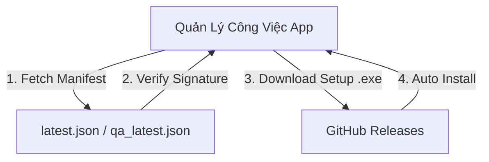

# Quản Lý Công Việc Desktop - Auto-Updater Repository

Kho lưu trữ cấu hình cập nhật tự động (Auto-Updater Manifests) và phát hành phiên bản (Releases) cho ứng dụng **Quản Lý Công Việc Desktop** (Tauri v2).

---

## 📌 Tổng Quan Architecture

Repository này đóng vai trò làm trung tâm phân phối bản cập nhật tự động cho các máy trạm sử dụng **Quản Lý Công Việc Desktop**.



---

## 📁 Cấu Trúc Repository

```text
.
├── .github/
│   └── workflows/
│       └── build-desktop.yml   # Workflow tự động build, ký số & cập nhật manifest
├── latest.json                 # Manifest cập nhật tự động cho môi trường Production
├── qa_latest.json              # Manifest cập nhật tự động cho môi trường Staging / QA
├── settings.json               # Cấu hình hiển thị thông báo & điều hướng cập nhật phía App
├── versions.json               # Danh sách và nhật ký các phiên bản đã phát hành
└── README.md
```